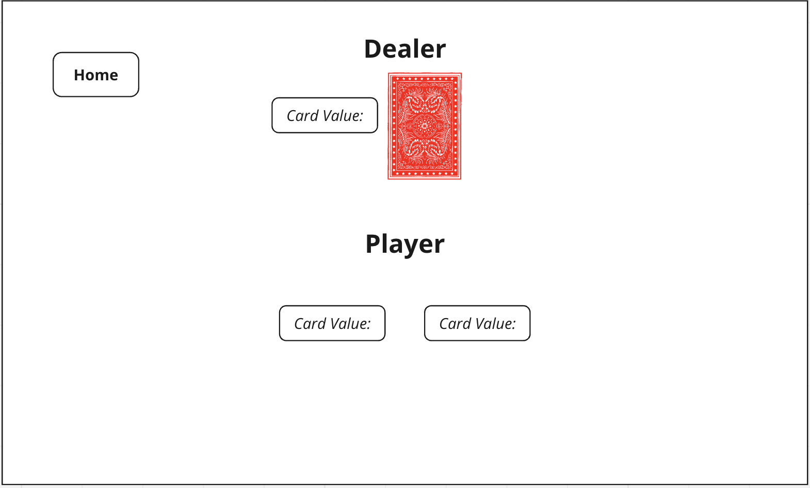
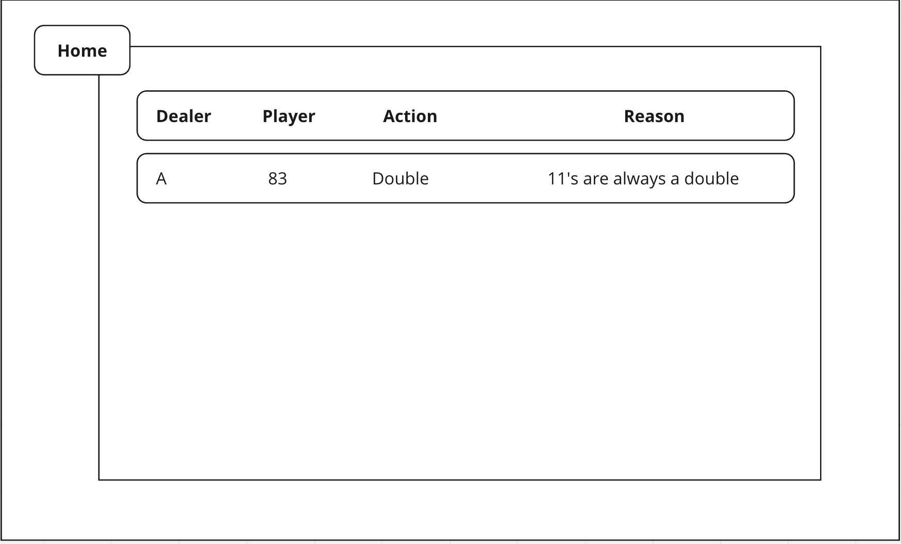
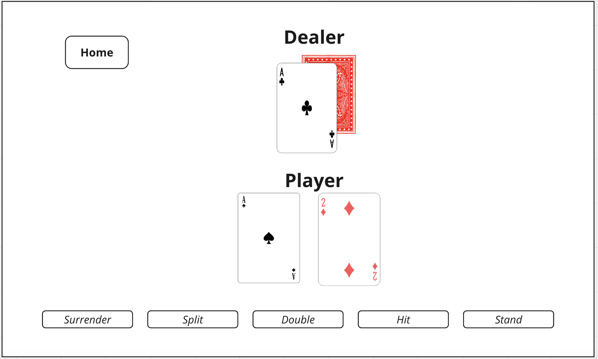
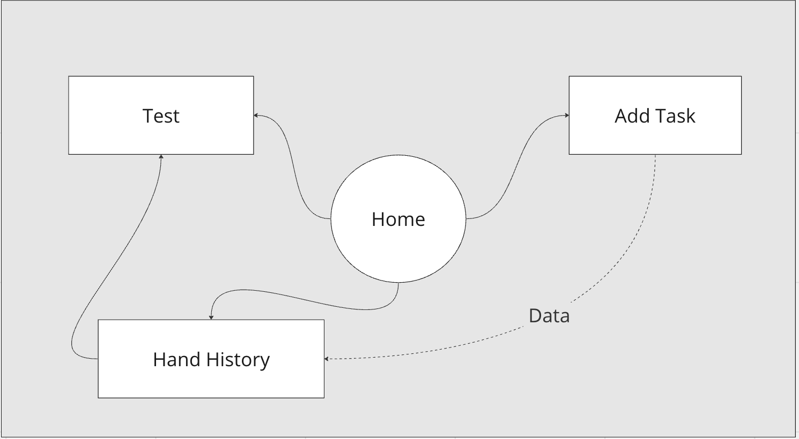

The content below is an example project proposal / requirements document. Replace the text below the lines marked "**TODO**" with details specific to your project. Remove the "TODO" lines.

# Blackjack Solver

## Overview

Blackjack is an American classic card game that notoriously causes massive variance swings for gamblers across all casinos. Glorified by movies and unrealistic internet personalities, the simply game has been misconstrued to be "easy" and "profitable". Unfortunately, without the proper training, this is not the case.

Welcome to your personal Blackjack Solver, a simple application designed to "solve" for basic strategy. Basic strategy is the fundamental skill-level all blackjack players need to "lose the least" in casinos. This solver, given any scenario of hands and cards, will provide the optimal basic strategy answer as well as a reason behind the action. We will also offer a practice run of inputted hands to test for previously inquired hands.

## Data Model

The application will store Hands, Practice Status and Reasons

- each hand will have to opportunity to be "practiced" via the Practice page
- reasons will be given per input, then stored with the hand history

Hand Example:

```javascript
{
  dealerHand: 6,
  playerCardA: "A",
  playerCardB: 7,
}
```

Hand History Example with Embedded Items:

```javascript
{
  hand:  // a reference to a Hand object
  number: //number
  hand: [
    { dealerHand: 6, playerhand: "A7", value: 18, soft: true, action: "double", reason: "Soft hands from A2 - A8 are always a double facing a dealer 6"}
  ]
}
```

## [Link to Commented First Draft Schema](db.mjs)

## Wireframes

/addHand - page for creating a new hand entry



/handHistory - page for showing all hands



/test - page for testing player based on entered hands in session



## Site map



## User Stories or Use Cases

1. on the application, I can input hand combonations to receive the optimal strategy action in blackjack
2. I can review inputted hand histories
3. I can test inputted hands to test accuracy and practice
4. I can remove hands that have been tested and approved

## Research Topics

- (6 points) React Front-end Framework
  - I'm going to be using react for front-end framework
  - Will be using reactive elements to create animations and cards
- (3 points) Use dotenv for Config Management
  - I will use dotenv to manage and build my application
  - Will use dotenv to load these variables into your application's environment.
- (1 point) Deck of Cards API
  - https://www.deckofcardsapi.com/
  - Use this API for card images, shuffling, and dealing

10 points total out of 8 required points

## [Link to Initial Main Project File](app.mjs)

## Annotations / References Used

1. [Deck of Cards API](https://www.deckofcardsapi.com/) - (https://github.com/crobertsbmw/deckofcards)
