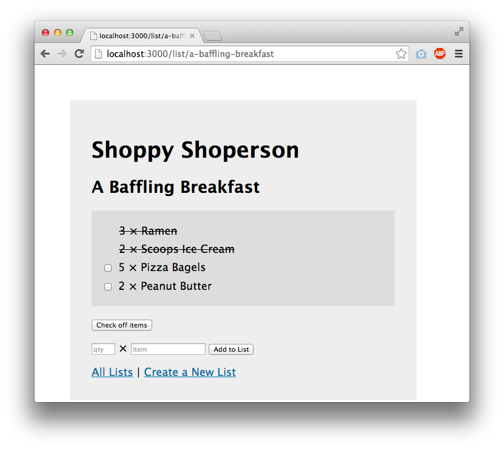

The content below is an example project proposal / requirements document. Replace the text below the lines marked "__TODO__" with details specific to your project. Remove the "TODO" lines.

# Blackjack Solver

## Overview

Blackjack is an American classic card game that notoriously causes massive variance swings for gamblers across all casinos. Glorified by movies and unrealistic internet personalities, the simply game has been misconstrued to be "easy" and "profitable". Unfortunately, without the proper training, this is not the case.

Welcome to your personal Blackjack Solver, a simple application designed to "solve" for basic strategy. Basic strategy is the fundamental skill-level all blackjack players need to "lose the least" in casinos. This solver, given any scenario of hands and cards, will provide the optimal basic strategy answer as well as a reason behind the action. We will also offer a practice run of inputted hands to test for previously inquired hands.

## Data Model

The application will store Hands, Practice Status and Reasons

* each hand will have to opportunity to be "practiced" via the Practice page
* reasons will be given per input, then stored with the hand history

Hand Example:

```javascript
{
  dealerHand: 6,
  playerHand: "A7",
  value: 18,
  soft: true,
  action: "double",
  reason: "Soft hands from A2 - A8 are always a double facing a dealer 6"
}
```

Hand History Example with Embedded Items:

```javascript
{
  hand:  // a reference to a Hand object
  number: //number
  hand: [
    { dealerHand: 6, playerhand: "A7", value: 18, soft: true, action: "double", reason: "Soft hands from A2 - A8 are always a double facing a dealer 6"}
  ]
}
```


## [Link to Commented First Draft Schema](db.mjs) 

## Wireframes

(__TODO__: wireframes for all of the pages on your site; they can be as simple as photos of drawings or you can use a tool like Balsamiq, Omnigraffle, etc.)

/list/create - page for creating a new shopping list


/list - page for showing all shopping lists


/list/slug - page for showing specific shopping list



## Site map

(__TODO__: draw out a site map that shows how pages are related to each other)

Here's a [complex example from wikipedia](https://upload.wikimedia.org/wikipedia/commons/2/20/Sitemap_google.jpg), but you can create one without the screenshots, drop shadows, etc. ... just names of pages and where they flow to.

## User Stories or Use Cases

(__TODO__: write out how your application will be used through [user stories](http://en.wikipedia.org/wiki/User_story#Format) and / or [use cases](https://en.wikipedia.org/wiki/Use_case))

1. as non-registered user, I can register a new account with the site
2. as a user, I can log in to the site
3. as a user, I can create a new grocery list
4. as a user, I can view all of the grocery lists I've created in a single list
5. as a user, I can add items to an existing grocery list
6. as a user, I can cross off items in an existing grocery list

## Research Topics

(__TODO__: the research topics that you're planning on working on along with their point values... and the total points of research topics listed)

* (5 points) Integrate user authentication
    * I'm going to be using passport for user authentication
    * And account has been made for testing; I'll email you the password
    * see <code>cs.nyu.edu/~jversoza/ait-final/register</code> for register page
    * see <code>cs.nyu.edu/~jversoza/ait-final/login</code> for login page
* (4 points) Perform client side form validation using a JavaScript library
    * see <code>cs.nyu.edu/~jversoza/ait-final/my-form</code>
    * if you put in a number that's greater than 5, an error message will appear in the dom
* (5 points) vue.js
    * used vue.js as the frontend framework; it's a challenging library to learn, so I've assigned it 5 points

10 points total out of 8 required points (___TODO__: addtional points will __not__ count for extra credit)


## [Link to Initial Main Project File](app.mjs) 

(__TODO__: create a skeleton Express application with a package.json, app.mjs, views folder, etc. ... and link to your initial app.mjs)

## Annotations / References Used

(__TODO__: list any tutorials/references/etc. that you've based your code off of)

1. [passport.js authentication docs](http://passportjs.org/docs) - (add link to source code that was based on this)
2. [tutorial on vue.js](https://vuejs.org/v2/guide/) - (add link to source code that was based on this)

